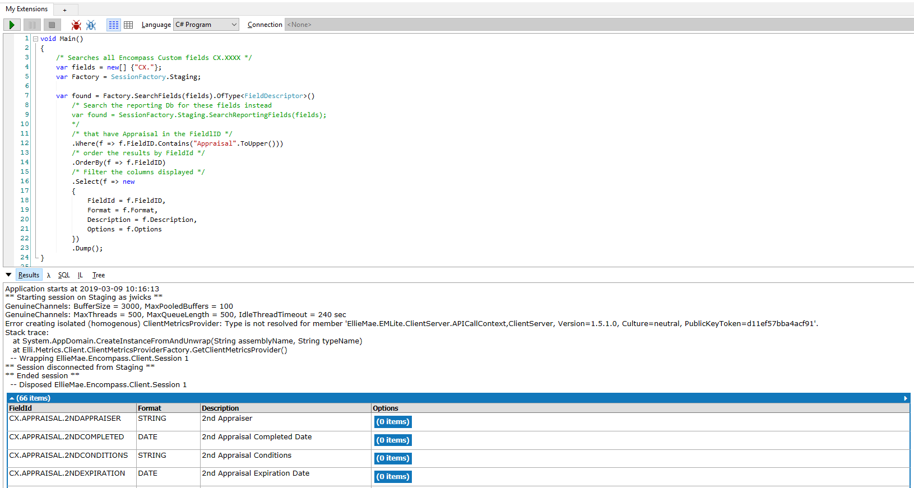
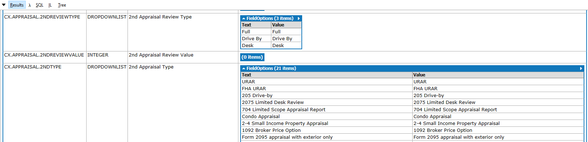
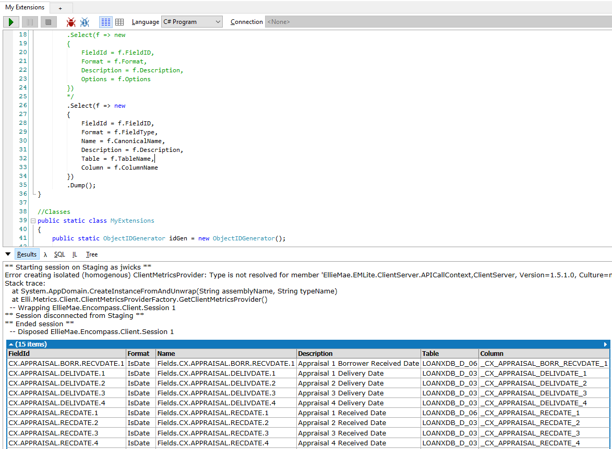

# Encompass.LinqPad
LinqPad queries and classes for Ellie Mae Encompass Loan Origination System (LOS)

## Installation

For these queries to function you must have access to an Encompass LOS System and have the appropriate Encompass SDK version for that server instance. If you've never installed the SDK you may also need to talk to your EllieMae rep to obtain some license keys. You can obtain a SDK from the following: http://download.elliemae.com/encompass/updates/18.1.0/encompass181sdk.exe, just substitute the appropriate version numbers. If you get a VersionException you'll know you have the wrong SDK installed. If you have multiple versions installed on your servers then you will have to use a VirtualBox setup to have both installed (See the Advanced Install below).

The MyExtensions LinqPad file will need to go into your MyExtensions file in the plugins directory for your [LinqPad](https://www.linqpad.net/) installation (see your Folder settings in Preferences) or you can just overwrite with this one if you haven't modified your own.

The references should all be standard for a normal Encompass install but you may have to tweak them to fit your system (F4). The NUnit and NUnitLite references are not strictly needed but it's great for testing.

Once you've updated the MyExtensions file to your plugins folder you'll need to edit the file and update the user names("YourUserNameHere") and server Id's("YourServerIdHere") for your Encompass servers. There are 4 instances, (Develop, Test, Staging, Production), defined by the Factory class but you may have only one server in your environment. If you only have one then use Production. Use as many of the defined instances as needed for your environment. You can comment out the others.

Once you've edited the file try running the file. LinqPad should prompt you for password's for the environment you are trying to connect to. If not make sure you update the passwords in LinqPad's Password Manager.

A typical run looks something like the following:


The benefits of this search are that you get to see the field values as well as the display text.


You can also display the Reporting Database fields by changing the code to look like the following:
```
var found = Factory.SearchReportingFields(fields).OfType<ReportingFieldDescriptior>()
  .Where(f => f.FieldID.Contains("Appraisal".ToUpper()))
	.OrderBy(f => f.FieldID)
	.Select(f => new
		{
			FieldId = f.FieldID,
			Format = f.FieldType,
			Name = f.CanonicalName,
			Description = f.Description,
			Table = f.TableName,
			Column = f.ColumnName
	})
	.Dump();
```
Results should look something like the following:


## Advanced Install
This setup is only required if you have multiple Encompass environments and each has a different version on the server, say 18.x on Production and 19.x on Develop and you have the Encompass SDK installed on your machine. If you don't have the SDK installed and all you are using is the SmartClient then you don't need this type of install. The SmartClient handles downloading the different assemblies.

This scenario is typical for large shops so they can test how new Encompass versions affect their code base while maintaining Production and Staging environments for current development.

### Gather the Troops
1. Download and install [VirtualBox](https://www.virtualbox.org/) or a similar tool.
2. Download/Install the VirtualBox Extension Pack.
3. Import my [VM image](VMs/Encompass-Development.ova) from this project.
4. Download the [Windows 10 virtual machine](https://developer.microsoft.com/en-us/windows/downloads/virtual-machines) from Microsoft. If they aren't offline that is "Our virtual machine downloads are currently unavailable, but will be available again soon.". If all else fails and you don't have Windows yourself to [make an image](https://www.itworld.com/article/2954567/how-to-create-a-windows-10-virtual-machine-in-virtualbox.html) you can use the [IE virtual machines](https://developer.microsoft.com/en-us/microsoft-edge/tools/vms/). They die after 90 days and include some programs you may not be interested in however. It's 4GB's zipped so be prepared. If you have an MSDN subscription you can use one of the images from there as well.
5. Enable Virtualization on your machine.
6. Open the Encompass (Development) image you imported from this project. You'll be prompted for the disk image from Microsoft.
7. Install the Encompass SmartClient and check your connection to the Encompass environment.
8. Install the Encompass SDK.
9. Install LinqPad and setup a shared folder to your projects within the VM. I use C:\Projects or I share that folder as P: drive. Whatever works for you.
10. Point LinqPad at the code from this repo. Check you connection to Encompass again.

## References
Encompass - https://www.elliemae.com/encompass/encompass-overview

SDK Downloads - https://resourcecenter.elliemae.com/resourcecenter/Downloads.aspx

SmartClient - https://elliemae.com/getencompass360
